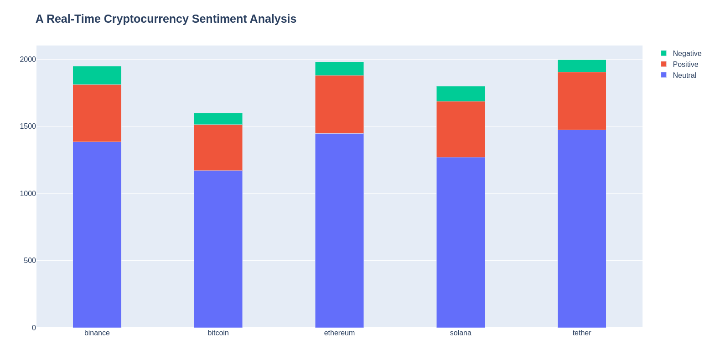

**A Real-Time Cryptocurrency Sentiment Analysis**

## Pipeline
The data is streamed into Apache Kafka from Twitter, then stored in a MongoDB database, and finally, the results are presented in a dashboard made with Dash and Plotly.
## Run code
1. Start zookeeper.
2. Start kafka on another terminal.
3. Create 5 kafka topic 
```
./bin/kafka-topics.sh --create --partitions 2 --replication-factor 1 --topic bitcoin-topic --bootstrap-server localhost:9092
./bin/kafka-topics.sh --create --partitions 2 --replication-factor 1 --topic ethereum-topic --bootstrap-server localhost:9092
./bin/kafka-topics.sh --create --partitions 2 --replication-factor 1 --topic binance-topic --bootstrap-server localhost:9092
./bin/kafka-topics.sh --create --partitions 2 --replication-factor 1 --topic tether-topic --bootstrap-server localhost:9092
./bin/kafka-topics.sh --create --partitions 2 --replication-factor 1 --topic solana-topic --bootstrap-server localhost:9092
```
4. Run the mongodb consumer 
```
bash run-consumer.sh
```
5. Run the twitter stream producer
```
bash run-producer.sh
```
6. Run the dashboard, it is updated in real-time
```
python dashboard.py
```
## Result

